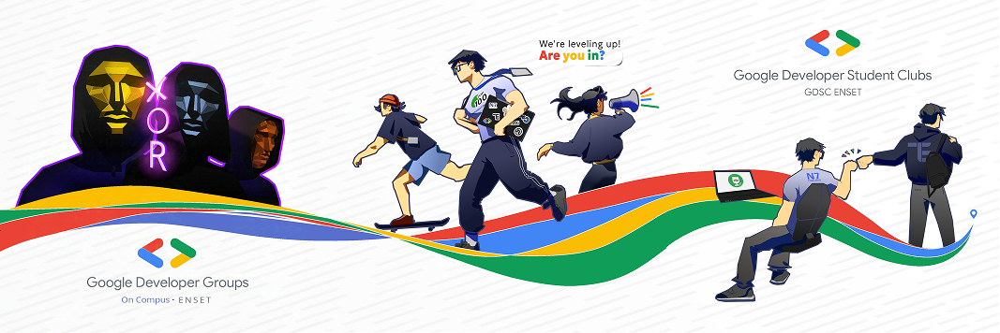
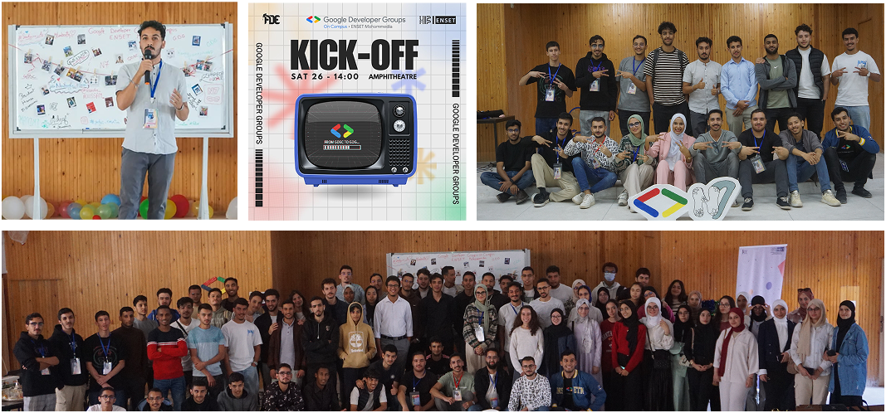
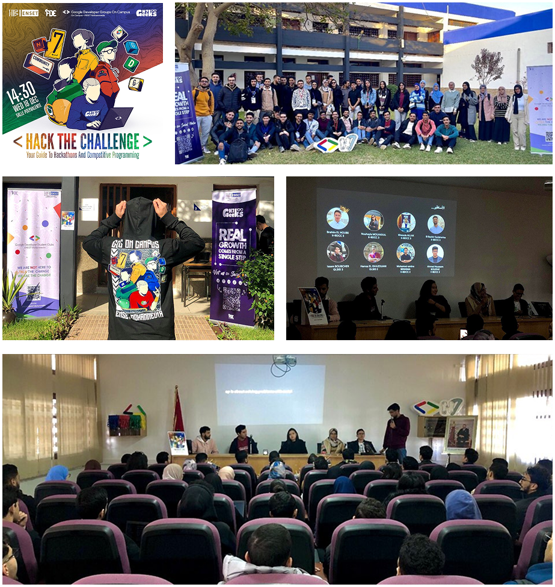
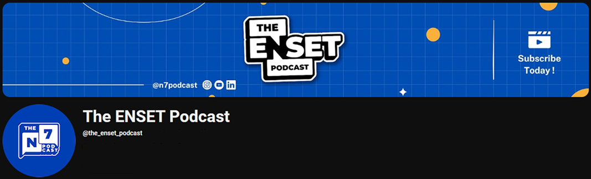
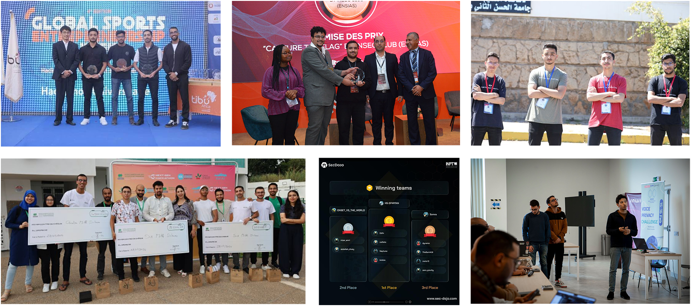
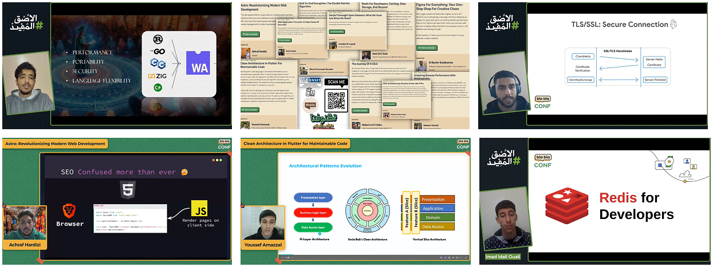

When I first considered joining an IT club, I had so many doubts. _Should I even join?_ I already study computer science—wouldn't it be better to join a club that focuses on soft skills, like public speaking? If I joined an IT club, wouldn’t I just be doing more of the same thing? On top of that, I barely kept up with my studies in my first year. Would I even be able to handle the extra workload? Would it just be a waste of time?

All these questions were running through my mind after I finished my first year of the _cycle d'ingénieur at ENEST Mohammedia_. But looking back, I realize now that all of these concerns stemmed from one thing: **Fear**

## A Little About Me

Hi everyone, I'm Achraf Hardizi, a second-year student in Software Engineering and Cybersecurity at ENSET Mohammedia. I’m also the Co-Lead of the **Google Developer Group on Campus** at ENSET. _Wait—where’s the fear you just talked about?_ Don't worry, I wrote this blog for everyone who's been in the same situation as I was and also to show the power of **Clubs**.

I know my doubts weren’t unique—many of our club members faced the same hesitation before joining. That’s why I want to share my journey and highlight the importance of joining a club. If you’re a student, getting involved in a club can be a **life-changing experience**. It has taught me so much, shaped my perspective, and turned me from someone hesitant and unsure into someone more confident and engaged.

## How It All Started

During the summer, I was doing an internship in Fes alongside my friend **Hamza El Ghazouani**, who was incredibly excited about becoming the president of our **GDG on Campus** club. (It was previously called **Google Developer Student Club (GDSC)** before Google changed the name.)

Hamza had already spent his first year as a core member of GDSC, and he was determined to take the lead. He believed the club had **huge potential**, especially given the diverse backgrounds of students at ENSET. Our school brings together students from CPGE, DUT, DEUG, DUEST, and BTS, meaning we have a mix of talent in various IT fields. Hamza had a vision of uniting these talents within the club, creating a space where collaboration and innovation could thrive.

We spent days discussing it, and I started to wonder: _What if I was wrong about clubs? What if it wasn’t a waste of time? What if I was just afraid of change?_

That’s when I made my decision. _Trying wouldn’t hurt_, and if things didn’t work out, I could always step away. But if I was going to do it, I wanted to give it my all. That’s when I started thinking seriously about how we could **manage the club differently** and **set it up for success**. I quickly realized that if we wanted the club to thrive, we needed to engage as many students as possible.

And that’s when everything changed.

## Setting Up for Success

During our internship, Hamza and I focused on **two key strategies** to make this year different from previous ones:

1. **Prioritizing ENSET students reputation**—promoting them and their work through the club.
2. **Strengthening our presence on social media**—but in a way that truly resonated with students, making our content relatable and engaging.

Before the academic year even started—especially before _Journée d’Intégration_—we released three reels ([1st](https://www.instagram.com/reel/DABx5qyuHCl/?utm_source=ig_web_copy_link&igsh=MzRlODBiNWFlZA==), [2nd](https://www.instagram.com/reel/DAGdJd5I-x-/?utm_source=ig_web_copy_link&igsh=MzRlODBiNWFlZA==), [3rd](https://www.instagram.com/reel/DAd5FZtt_eE/?utm_source=ig_web_copy_link&igsh=MzRlODBiNWFlZA==) reel link 😉) on social media. These weren’t just promotional videos; they were designed to communicate a **shift in mindset** for the club. We wanted to show that our club wasn’t just about events and workshops—it was about building a **community**. A place where people could **do what they love**, **push each other to grow**, and **surpass their limits, here’s our IG Account [“GDGC_ENSET”](https://www.instagram.com/gdgc_enset) if you want to have look**

And it worked. In just a few days, our reels gained more traction than anything the club had done in previous years. First-year students started reaching out, eager to learn more and **excited to join us**.

## Kicking Off Our First Contact with Students

During _Journée d’Intégration_, all clubs at ENSET are expected to host a **kickoff event** to introduce themselves to students, explain their goals, and showcase their main activities for the year. Our kickoff event drew nearly **100 attendees** from different departments—an exciting start!

I had the responsibility of **hosting the event**, and it was my first time being _"on stage"_ in front of an audience. At first, the thought of speaking in front of so many people was intimidating. But once I realized that the audience was there because they genuinely wanted to learn about our club, everything changed. They weren’t there to judge me; they were there because they believed we had **something valuable to share**. From that moment, speaking became more natural—I simply had to be myself and talk about my experience.

## Our Main Activities

At the kickoff, we introduced several key initiatives that would shape our club’s direction:

- **The Volunteer Program**: We introduced a new concept allowing non-core members to actively participate in organizing specific events. This gave students an opportunity to gain real-world event management experience without having to commit full-time to the club.
- **Boosting Our Social Media Presence**: To make ENSET students more visible in the larger tech community, we decided to attend external events together, document our experiences, and share them online. This approach not only increased our reach but also helped us exchange knowledge and learn from other universities and tech communities.
- **GDG Battle – A Community Leaderboard**: To maintain **transparency and engagement**, we launched a competitive ranking system called **GDG Battle**. Members earned points for participation, event organization, and community contributions, which were displayed on a public leaderboard. The goal was to **recognize commitment** and **motivate everyone to stay active**.

We wrapped up the kickoff with some fun activities and icebreaker games, giving everyone a chance to connect and start building relationships. It wasn’t just about **recruiting members**—it was about **building a real community**.

Our kickoff event didn’t just capture the attention of students—it also inspired **other clubs**. For example, **ENSPEC** (ENSET’s English-speaking club) expanded on our idea, using a similar approach to promote **public speaking**. This showed us that the impact of our club could extend beyond just IT and into other domains. For more infos on events you can check [our website](https://gdg.community.dev/gdg-on-campus-enset-ecole-normale-superieure-de-lenseignement-technique-de-mohammedia-mohammedia-morocco/) it contains all upcoming events

## The Start of Club Activities

With our vision set, we jumped straight into action. One of our biggest priorities was **encouraging club members to share their knowledge**. Rather than just bringing in external speakers, we motivated our own students to **explain IT concepts**, making the sessions feel more **authentic and relatable**.

Throughout the year, we organized numerous **talks and workshops** on topics like:

- **Machine Learning & Deep Learning**
- **Generative AI**
- **Rust Programming Language**
- **And much more...**

One of our most impactful events was **Hack the Challenge**, where **ENSET alumni** shared their experiences in **hackathons and competitive programming**. They provided **valuable advice** on:

- **Choosing the right project ideas**
- **Building a strong business plan**
- **Managing time effectively under pressure**
- **Presenting ideas confidently to judges**

These conversations weren’t just informative—they felt like **discussions between older and younger siblings**, where alumni genuinely wanted to help the next generation succeed.

We also made a conscious effort to **keep our topics advanced and engaging**. Instead of repeating **basic tutorials** like "Introduction to Web Development," we set the **bar higher**, pushing our community members to **explore deeper and more cutting-edge subjects**.

To ensure we reached **everyone**, we didn’t limit our activities to just in-person events. We embraced **online content**, allowing us to **expand beyond ENSET** and share valuable insights with a wider audience. This led to the birth of **The ENSET Podcast.**

## [The ENSET Podcast 🔗](https://www.youtube.com/@the_enset_podcast) — A Platform for Knowledge Sharing

As part of our online presence, we integrated an existing project started last year by a group of ENSET students—**Youssef Faik, Mohammed Bourhym, Souhail Bektachi, Youssef Ammazal, and Houssam Karoum**—called **The ENSET Podcast** _(aka N7 Podcast with N7 referring to ENSET)_.

The idea behind The ENSET Podcast was simple yet powerful: **connect students with industry experts**. Through interviews, we created a bridge between **experienced professionals and students**, allowing them to gain insights, ask questions, and learn from real-world experiences. To keep this initiative alive and strengthen its impact, we collaborated with the original team to make **The ENSET Podcast a true ENSET brand**.

Since the start of the Podcast, we’ve covered several insightful topics, including:

- **Web Development with Astro** – Featuring guest **Elian Van Cutsem**, who shared his knowledge on modern web frameworks.
- **Engineers in Action** – A session featuring **ENSET alumnae** now working in the tech industry. They shared their experiences and encouraged more female students to join **competitions and clubs**, reinforcing the message that **tech is for everyone, regardless of gender**.
- **Cloud Computing & Big Data** – With our Beloved Moroccan Expert **Abdelfettah Sghiouar**, who provided deep insights into cloud infrastructure and data management.

Managing The ENSET Podcast hasn’t been easy—we’ve faced technical, scheduling, and logistical challenges along the way. But despite the obstacles, the experience has been **incredibly rewarding**. Getting the opportunity to **meet and talk to industry experts**, exchange ideas, and **share these valuable discussions with the community** is something truly special.

Want to check out our episodes? [The ENSET Podcast Youtube Channel 🔗](https://www.youtube.com/@the_enset_podcast)

## Competitions

One of our main objectives at GDG ENSET was to **encourage students to step out of their comfort zones** and **showcase their talents** by participating in competitions. Whether it was **hackathons, competitive programming, or cybersecurity challenges**, our message was clear:

📌 **Winning isn’t the goal but learning is.**

Competitions provide an incredible opportunity to **gain hands-on experience, work on real projects, and build a strong portfolio**. Regardless of the outcome, every participant walks away with **new skills, a valuable network, and a project to add to their CV**.

### Achievements of ENSET Students

We were proud to see many ENSET students not only participate but also **rank among the top performers** in various competitions across different IT fields:

- **A2SV International Hackathon** – The **N7 Team** secured **Top 32** out of **1,110 teams** from **48 African nations**.
- **Next Gen Hackathon (EMSI)** – **N7 Team** clinched **2nd place** in this highly competitive event.
- **Morocco’s Cybersecurity Days** (hosted by **Cyberforces & INSEC Club**) – Our team **won 1st place**, proving our strength in cybersecurity.
- **Voice Privacy Challenge** – Our team achieved **3rd place**, demonstrating excellence in privacy-focused AI and security.

### What _N7 Team_ Means

The **N7 Team** is not a fixed group—it’s a name that **any ENSET student can represent** in competitions. We chose to keep this identity open to encourage more students to take part and uphold ENSET’s reputation in the tech community.

### More Than Just Winning

Our vision was to **build a culture of participation and competitiveness**, where students **overcome their fear of competing** and take every event as a **learning experience**.

🏆 **Winning is great, but the true value lies in networking, learning new technologies, and pushing yourself beyond your limits.**

## [BlaBlaConf 5.0](https://blablaconf.com/): Overcoming Doubts & Taking the Stage

When **BlaBlaConf 5.0** was announced, we were all excited yet hesitant. As club members, we admired the **incredible Moroccan experts** who regularly spoke at the event, and we couldn't help but wonder—**do we really have something valuable to share?**

At first, most of us were reluctant to **submit a talk**, believing that with our humble experience, it would be better to leave the stage to more seasoned professionals. But thanks to the encouragement of our president, **Hamza Elghazouni,** and our club manager, **Zakaria Azmi**, our perspective changed. They reminded us that **perfection isn’t the goal—sharing knowledge and insights is what truly matters**. Their motivation pushed us to step out of our comfort zones and submit talks on topics we were passionate about.

At the time, I was deep into Astro, a modern web framework, and had built a few simple projects with it, including a **portfolio and landing page** that contributed to win us **1st place in the Tubi competition**. I figured that if I found Astro useful, **others might benefit from learning about it too**. So, I took a leap of faith and submitted my talk—just before the deadline, still unsure if it would be accepted.

Days passed, and then came the big surprise: **several talks from ENSET students got accepted!** The excitement was unreal. We immediately **shifted from self-doubt to determination**, eager to deliver the best presentations possible.

The **UX, Web & Mobile track** on the first day was **dominated by ENSET students**, with five talks from our current students, alongside other speakers who proudly announced they were **ENSET alumni**. Seeing **our school students shine** on such a major event was a moment of pure pride. My talk on **Astro** was well received, and hearing positive feedback from attendees made the experience even more rewarding.

### **The Biggest Lesson?**

We all have something valuable to share—it’s often **self-doubt** that holds us back. **Stepping out of our comfort zones unlocks opportunities we never imagined possible.** BlaBlaConf 5.0 wasn’t just a conference; it was a **reminder that growth happens when we take risks and put ourselves out there**. 🚀

## Conclusion: The Power of Community

Looking back on my journey with GDG on Campus, I can confidently say that joining this club was one of the most transformative experiences of my academic life. It wasn’t just about organizing events or learning new technologies—it was about growth, connections, and impact.

Through this club, I challenged myself in ways I never imagined. From public speaking to event management, from mentoring peers to competing in hackathons, I developed both my technical and soft skills. I learned to collaborate, communicate, and lead, which are just as important as coding in any tech career.

But beyond personal growth, the true power of a community lies in its ability to lift everyone up. Being surrounded by passionate, like-minded people pushes you to be better. Whether it’s through knowledge-sharing, teamwork, or simply the motivation that comes from seeing others succeed, a strong community fuels progress.

So, if you’re in university or school and wondering whether you should join a club, my advice is simple: Do it.

- ✅ It will expand your skills beyond the classroom.
- ✅ It will connect you with incredible people who share your passion.
- ✅ It will open doors to opportunities you never expected.

Growth doesn’t happen in isolation—it happens within a community. So step in, get involved, and watch how it transforms you. 🚀🔥
