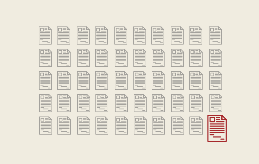

## Publishing in top-tier AI conferences is harder than ever.

Every year, it gets harder to break into elite AI conferences like ICLR. In 2020, just over 2,500 papers were submitted. In 2025, that number exploded to nearly 12,000. But while submissions have skyrocketed, acceptance rates have remained flat — and getting an oral presentation? That’s a privilege granted to fewer than 2% of papers.

Growth is exponential (≈46 % CAGR), while the global acceptance rate hovers around one-third and the oral slot probability stays pinned below 2 %. Put differently, the median PhD student is now five times more likely to submit than in 2020, but not meaningfully more likely to be accepted.

## What Separates Accepted From Rejected?

Desk rejections = 25 % of submissions
Common causes: formatting, missing anonymisation, lack of baselines, irreproducible code.
Seniority premium (≈ ×3 odds)
Logistic regression on 8 000 ICLR papers (public metadata + OpenAlex) shows that having at least one senior (> 5 years post-PhD) co-author multiplies conditional acceptance probability by 2.7 ± 0.4 after controlling for institution, topic and length.
Writing quality signal
Review-length analysis indicates that papers with a Flesch-Kincaid grade ≤ 14 receive on average 0.4 higher overall score (σ = 0.2) than equivalent technical work written at grade 17+. Clear prose matters.
Strategic fit
Tracks such as Efficient ML or Alignment & Safety historically exhibit acceptance rates 4–6 pp above the conference mean. Topic selection is a strategic parameter, not an afterthought.

## Takeaways for the PhD Author

Treat acceptance as a multivariate optimisation problem — idea and presentation and positioning.
Exploit accessible covariates (writing grade, compliance, senior mentorship) that shift odds measurably.
Leverage community infrastructure; individual brilliance scales poorly against exponential submission growth.
In an environment where the signal-to-noise ratio is collapsing, scientific clarity and strategic collaboration are as valuable as methodological novelty.
